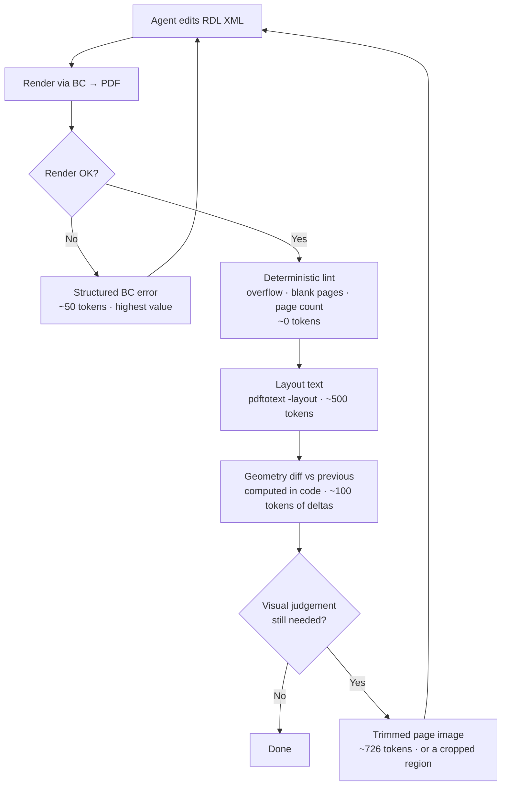

# The Feedback Loop: How the Agent Sees Its Own Changes

Your instinct — *"take a snap of the PDF to assess changes and iterate"* — is correct,
and it works. But a screenshot should be the **last** channel the agent reaches for,
not the first. This document shows why, with numbers measured on your own sample.

> **Applies to Word layouts too.** BC renders both RDL and docx layouts to PDF, so
> everything below is format-agnostic — only the *editing* surface differs. See
> [docx-layouts.md](./docx-layouts.md).

## The experiment

Using `rdl_previewer/preview.pdf` (the real BC output for report 61206, A4, 1 page,
produced by Aspose.PDF 25.6.0):

```bash
pdftoppm -png -r 110 preview.pdf page   # 72 ms
```

That PNG was then read back as an image, and the report was fully legible: header,
"Test Report (Not Posted)", the posting-date block, the 11-column VAT table with its
right-aligned amounts, grey group rows, red negative figures, and the bold total.

**The premise holds.** A model can absolutely assess RDL layout from a rasterized page.
The engineering question is not *whether* — it is *what to send, at what resolution,
and how often*, because that is what determines whether the loop converges cheaply or
burns 30k tokens flailing at a font size.

## Measured costs

Image token cost ≈ `width × height / 750`.

| Channel | Command | Size | Est. tokens |
|---|---|---|---|
| Layout text | `pdftotext -layout` | 2,008 chars | **~500** |
| Page @ 72 dpi | `pdftoppm -r 72` | 596×842 | ~669 |
| Page @ 96 dpi | `pdftoppm -r 96` | 794×1123 | ~1,188 |
| Page @ 110 dpi | `pdftoppm -r 110` | 910×1287 | ~1,561 |
| Page @ 150 dpi | `pdftoppm -r 150` | 1241×1754 | ~2,902 |
| Page @ 200 dpi | `pdftoppm -r 200` | 1654×2339 | ~5,158 |
| **150 dpi, trimmed** | `+ magick -trim` | **1072×508** | **~726** |
| Geometry (raw) | `pdftotext -bbox-layout` | 25,900 chars | ~6,500 |

### Finding: trim before you rasterize

This report uses the top ~40% of an A4 page; the rest is white. Trimming to content at
150 dpi costs **~726 tokens — 4× less than the untrimmed 150 dpi page, and slightly
*less* than a 72 dpi full page while being more than twice as sharp.**

> Downscaling to save tokens is the wrong lever. **Crop, then keep the DPI.**

Trim with a small white border so the agent can still see margin relationships:

```bash
magick page.png -bordercolor white -border 10 -trim +repage out.png
```

(Keep the pre-trim offsets — the agent needs them to map pixels back to page
coordinates, and therefore back to RDL elements. See §"Anchoring".)

### Finding: text alone catches real layout bugs

`pdftotext -layout` on the sample, unprompted, exposes a genuine defect:

```
06/17/25   PSCM/25/00007   Credit    Sale     500.00   25.00  ...  3116   SRICHAR
                           Memo                                            AN
```

Two columns are too narrow. "Credit Memo" wraps, and the user ID "SRICHARAN" splits
into `SRICHAR` / `AN`. That is a ~500-token observation that would otherwise have cost
~2,900 as an image — and it is *more* actionable, because the text form makes the
column boundaries explicit.

Column truncation, wrapping, missing values, wrong formats, wrong sort order and
missing rows are **all visible in text**. Reserve pixels for what text genuinely cannot
show: alignment, borders, shading, font weight/size, spacing, and overall "does this
look right".

## The three-channel ladder

Cheapest first. Escalate only when the cheaper channel cannot answer the question.



**Channel 0 — errors (free, most valuable).** An RDL that fails to render must return
BC's actual error text as a structured tool failure. This is the single highest-value
signal in the system and the current previewer throws it away into `console.error`.

**Channel 1 — deterministic lint (free, no model).** Some defects need no judgement at
all and should never cost a token:

- body width + margins > page width → the classic RDL bug where every second page is
  blank. Detectable from the XML alone, before rendering.
- page count changed unexpectedly
- any element's bbox crosses the printable margin
- overlapping textboxes
- a textbox that grew and pushed content off-page

Encode these as rules. They are cheaper *and* more reliable than hoping a model
notices.

**Channel 2 — layout text (~500 tokens).** Every iteration. Values, wrapping,
truncation, ordering.

**Channel 3 — geometry diff (~100 tokens of deltas).** `pdftotext -bbox-layout` gives
every word's `xMin/yMin/xMax/yMax` in points. **Never send it raw** — 25,900 characters
is absurd. Parse it, diff it against the previous iteration in code, and send only the
change:

> `Column "User ID" xMax 512.4 → 500.1 (−12.3pt). 2 words now wrap that did not before.
> Table height 84pt → 97pt. Nothing else moved.`

This is the highest signal-to-token ratio in the whole system, and it is what turns
"try something and look at it" into "verify the change did exactly what was intended."

**Channel 4 — pixels (~726 tokens trimmed).** On demand, for visual judgement only.

## Anchoring: the piece that makes it converge

The agent's hard problem is not seeing the defect. It is **mapping a defect back to the
RDL XML that caused it**. Without help, it greps 4,139 lines of XML containing 386
`<Style>` and 120 `<Textbox>` elements and guesses.

The fix is a locator built from the bbox data: given a page coordinate or a piece of
rendered text, return the RDL element that produced it.

```
"SRICHAR" @ (783, 366)–(820, 373)
  → Tablix1 / row group "VATEntry" / cell 10
  → <Textbox Name="UserID_VATEntry">  (Default.rdl:3218)
  → current: <Width>1.4cm</Width>, CanGrow=true
```

Expose this as a tool (`rdl_locate`). It collapses the search step that otherwise
dominates the iteration count. Build it from `rd:DefaultName` / `Name` attributes plus
the rendered text content — RDL textbox names survive into the layout well enough to
anchor most cells, and dataset field names give a second join key.

## Multi-page reports

The sample is one page; real BC reports are not. Rules:

- Never send every page. Send **page 1 plus any page whose geometry diff changed**,
  capped at 2–3 images per iteration.
- Report the page count and total change summary in text always.
- Let the agent request a specific page or **a cropped region of a page**
  (`rdl_page_image(page: 3, region: [x,y,w,h])`). Zooming into a suspect table at 200
  dpi costs a fraction of a full page and is far more legible — this is the single best
  token lever after trimming.

## MCP tool surface

MCP is the right shape here, and it composes with ACP exactly as needed: **the MCP
server is the tool surface; ACP's `session/new` attaches it identically to every
provider.** MCP tool results can carry image content, so the agent receives page
renders as *tool output* — no need to inject images into the prompt, and it works
regardless of whether a given agent advertises `promptCapabilities.image`.

```
rdl_render(path?, params?)      → { ok, pageCount, lint[], layoutText, durationMs }
                                  or { ok: false, bcError }   ← structured, always
rdl_page_image(page, dpi?, region?, trim?=true)
                                → image content block (trimmed by default)
rdl_text(page?)                 → pdftotext -layout output
rdl_diff()                      → geometry deltas vs the previous render
rdl_lint()                      → deterministic rule violations
rdl_locate(text|coords, page)   → the RDL element + file:line that produced it
rdl_params(...)                 → inspect/adjust reportParamsXml, dataset selection
```

Deliberately **not** a tool: raw file read/write. The agent's own Read/Edit tools
already handle the RDL XML, and every provider has them.

### Transport: prefer HTTP, ship stdio

The desktop app and the agent must see the *same* render — the user should be looking
at the PDF the agent is reasoning about. That argues for the app owning the render
engine and exposing MCP over **localhost HTTP** (`mcpCapabilities.http`), with one
shared session.

But **stdio is the only transport all ACP agents must support.** So: ship a small stdio
binary that proxies to the running app's local HTTP port (as sketched in the
`session/new` example in [tech-stack.md](./tech-stack.md#attaching-our-tools-provider-agnostically)),
and use direct HTTP when the agent advertises it. One code path for state, two thin
transports.

### Render arbitration

Two things can trigger a render: the file watcher (a human editing in VS Code) and the
agent's explicit `rdl_render` call. Left alone they will double-render, and the watcher
will happily render a **half-written file** mid-edit.

- Agent renders are explicit tool calls. Suppress the watcher during agent writes.
- Debounce, then **dedupe on content hash** — identical bytes must never cost a BC
  round trip twice.
- Meter renders per session. Each one is real latency and real load on someone's BC
  environment.

## Convergence control

Vision loops flail when the agent has no stopping rule. Give it one:

- **State the hypothesis first.** Require the agent to say what it expects the render to
  change *before* calling `rdl_render`. Cheap, and it makes wrong turns obvious.
- **Stop when lint passes and the geometry diff matches the hypothesis** — not when the
  agent feels satisfied.
- **Cap iterations** (start at 10) and cap images per iteration (2–3).
- **Keep the original render** and offer a first/last visual comparison at the end, so
  the human judges the outcome rather than the agent grading its own work.

## Cost model

| Iteration type | Tokens |
|---|---|
| Error-only (failed render) | ~50 |
| Text + diff (typical) | ~600 |
| With one trimmed page image | ~1,400 |
| With a zoomed region instead | ~900 |

A 20-iteration session mixing these lands around **15–20k tokens** of feedback. That is
comfortably affordable — but only because pixels are rationed. Sending a 150 dpi
untrimmed page every iteration would cost ~58k for the same session, and a 200 dpi one
over 100k.

## What still needs proving

1. **BC round-trip latency.** Unmeasured, and it sets the pace of everything. If it is
   8 seconds, a 10-iteration loop is 80 seconds of dead time and the UX must be built
   around that.
2. **Does `rd:DefaultName` survive into the PDF reliably enough** to make `rdl_locate`
   accurate on complex tablixes? Test on a real multi-group report.
3. **Multi-page geometry diffing** on a report with variable page counts — page
   insertion will shift everything and naive diffs will report the whole document as
   changed. Needs alignment, not positional comparison.
4. **Whether trimming misleads on margin bugs.** Cropping away whitespace can hide the
   very margin overflow we care about. Mitigation: lint checks margins numerically, and
   `trim: false` stays available.
